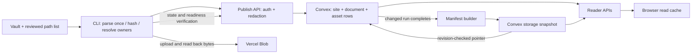

# 4. Publishing architecture

As inspected on 2026-09-23: CLI 0.2.1, backend changes through `17591b90`, and
release branch `a1827b2d`. This describes the implemented publish path and its
reader boundary. Proposed changes are in [the case studies](06-publishing-case-studies.md).
For the wider application, start with [the overview](01-overview.md).

The system is a **centrally coordinated, scoped reconciliation pipeline with
individually committed writes and a derived reader snapshot**. Local files express
the author's intended changes; Convex owns the current published state. The
publish lease serializes cooperating publishers for a site. It does not turn an
entire publish into one database transaction or provide automatic merge semantics.

## Components and authority

| Component | Responsibility and authority |
| --- | --- |
| Local vault and Git checkout | Authoring files and reviewed scope. Git history is separate from deployed content history. |
| Local CLI | Parse files, resolve dependencies/visibility, plan selected changes, upload, verify, report completion. |
| Same-origin publish API | Authenticate the site/token, apply site redaction, validate requests, call Convex and check reader readiness. |
| Convex documents/assets | Durable current rows, normalized source and reader content, content/visibility hashes, metadata and embeddings. |
| Convex site row | Run owner, scope, lease, change marker, manifest revision and installed snapshot pointer. |
| Vercel Blob | Attachment bytes under site-prefixed, content-derived paths for scoped uploads. |
| Convex storage and manifest builder | Derived public navigation/metadata snapshot; installed only for a matching revision and format. |
| Reader application | Fetch authorized content; maintain a persistent LiveStore read cache, with memory fallback. This cache is not a publishing authority. |



## One scoped publish

1. **Read local inputs.** Inventory and parse the vault once. Select the reviewed
   Markdown paths; resolve referenced assets using all owners, including documents
   outside the selection. A private co-owner must affect a shared asset's
   visibility. Hash selected asset bytes. This is an in-memory scan, not an
   operating-system filesystem snapshot: files can still change while scanning.
2. **Plan.** A dry-run calls `/scoped/begin` with `dryRun: true`; it does not acquire
   a lock, sync files, upload, embed or finish. A real invocation acquires the
   site's ten-minute lease using a unique run ID and declared scope, then reads
   current selected state. It replans; it does not apply a persisted, immutable
   dry-run plan guarded by its original remote revision.
3. **Write.** Parallel workers submit changed documents and assets. Each relevant
   Convex mutation checks the run owner, lease and declared paths in the same
   transaction as its write. Scoped omissions never imply deletion. Independent
   mutations bypass the HTTP client's default mutation queue. Optional embeddings
   are generated according to the explicit policy.
4. **Verify stored data.** `/state` returns bounded selected metadata and computed
   digests, not document bodies. Default verification compares normalized source,
   redacted reader consistency and asset registration/visibility. Missing or oversized
   source copies cannot pass full content verification; metadata-only verification
   is an explicit weaker policy. New uploads are
   rehashed before upload and downloaded afterward for byte/size verification.
5. **Finish.** The server's first actual manifest-affecting mutation marks the run
   changed. Changed finish advances the manifest revision and queues a rebuild;
   a no-op retains the revision and reuses a current-format snapshot with an
   existing blob. Missing/stale snapshots request repair even after a no-op.
6. **Confirm reader readiness.** `/status` checks a current revision at least as new
   as the finish result, downloads and hashes the snapshot, and checks selected
   public membership/private exclusion. PDFs also require manifest membership;
   file/PDF access and hashes use indexed reader queries. The CLI polls for up to
   15 seconds and reports success only after confirmation.

The builder runs separately: read metadata pages, filter, build the tree, hash,
serialize, store and install. Installation compares the build's captured revision
and format against current state; stale output is discarded and another build
requested. Scheduling coalesces requests with a two-minute build lease. The old
snapshot blob is removed after replacement; this is not a release-history store.

## Consistency and failure contract

| Boundary | What the implementation guarantees | What it does not guarantee |
| --- | --- | --- |
| One Convex mutation | Atomic update with transactional ownership/scope checks | Atomicity across every mutation in a publish |
| Site publish lease | Participating writers must own the live run; late/stale writes and aborts fail | A frozen view for readers, or protection from every possible admin operation |
| Dry-run followed by publish | Fresh planning during the real run | Preservation of the exact reviewed remote base or three-way conflict resolution |
| `/state` verification | Current selected source/reader/asset state checks | One database snapshot spanning all batches and future requests |
| `/status` success | Selected scope agrees with the checked current reader projection | Every browser has refreshed, or every page and asset in the site was checked |
| Abort or expired lease | Release ownership; invalidate if partial manifest-affecting writes occurred | Rollback of already committed rows or uploaded blobs |

Convex supplies serializable transactions for individual mutations. A sequence
of HTTP requests and mutations is still a sequence of commits; external blob
writes are outside those transactions. [Convex transaction documentation](https://docs.convex.dev/database/advanced/occ).

Readers can observe partial progress through current-row queries. During an owned
run, manifest revision invalidation is deferred to completion/abort/expiry. A
previously scheduled builder can overlap those writes, and its pages are separate
queries. **Inference from the implementation:** the revision check rejects builds
that have become obsolete by installation time, but it does not establish a
single immutable release across all pages, assets and reader requests. This is a
boundary to test explicitly before promising atomic publication.

Workers drain before abort. A failed upload or incomplete verification is an
error, not a skipped success. A failure after finish means data may already be
committed; the CLI reports it as unconfirmed and does not attempt an unowned
rollback. Missing change-tracking state from an older run conservatively triggers
invalidation. Lost response/retry handling is not an exactly-once workflow or a
durable per-operation receipt log.

## Identity, dependencies and caches

Document hash recipe 3 covers normalized title/body/tags and sensitivity fields;
it is not a Git blob hash of the literal Markdown file. `hashBytes` uses the first
16 hex characters of SHA-256. Manifest hashes use 24 hex characters and include
schema/site/scope, pages, tree and assets. These are change/integrity fingerprints,
not signatures, access credentials or a complete version graph.

Asset byte identity and visibility are separate. `visibilityHash` includes owner
slugs and their sensitivity/include metadata. Reusing an asset byte hash cannot
justify reusing its permissions. Scoped upload paths include the site, kind,
content hash and original path, but writes permit overwrite: this is not a strict
immutable, globally deduplicated object store.

| Cached or derived state | Validity rule |
| --- | --- |
| Publisher parsed vault | Shared only within one invocation; next invocation reads files again |
| Server public snapshot | Current site revision, format and available storage; reader verification still checks bytes |
| Browser read cache | Reader synchronization/authentication rules; not proof that a publish succeeded |
| Sync download cache | Separate site/vault-keyed asset state under `~/.cache/wiki-sync`; not the publisher's parse cache |

`sync` is an explicit remote-to-local reconciliation path. Differing existing
Markdown is written to `.wiki-sync-review` for review. It does not automatically
merge concurrent text edits. Scoped publishing does not sync first unless asked.

## Controls and observability

Use a pinned project-local CLI. Diana currently uses a reviewed vendored 0.2.1
package; the public npm release remains pending authentication. A newer global
command does not upgrade a vault-local dependency.

```sh
oncobase publish --site <slug> --vault /path/to/vault \
  --files-from /tmp/reviewed-files.json --assets referenced \
  --embeddings auto --verify content --dry-run
```

Review the plan, then use the same arguments without `--dry-run`. Scope files are
nonempty arrays of vault-relative Markdown paths. Limits are 1,000 selected
documents, 1,024 assets and 200 KB of declared scope; `/state` batches at 16
documents/128 assets. Default worker counts are 16 documents and 6 assets, with a
20-second request timeout. The whole-vault legacy path retains full inventory,
sync and explicit tombstone safeguards; it has not acquired all scoped semantics.

Skipping embeddings leaves stale vectors; skipping assets skips ownership and
visibility updates; metadata verification trusts more stored metadata than the
default content check. A success on the selected scope is not a full-site audit.

Private local profiles are automatic. Fixed phase names and numeric metrics cover
scan reuse, hashing, requests, retries, embeddings, uploads and verification.
`Server-Timing` works without a collector; optional backend OTel adopts the CLI's
trace parent for API/RPC work. Asynchronous manifest phases are separate structured
logs, not yet one joined end-to-end distributed trace. Profiles omit content,
credentials, URLs and document identifiers.

[Measured cache experiments](../../specs/publish-cache-experiments-2026-09-23.md)
record production no-ops at 2.20–2.41 seconds and matched synthetic 100-document
writes at 9.79–10.55 seconds. Read-only benchmarks omit writes/finish and cannot
measure release readiness. Provider delays and bulk bytes preclude a universal
20-second promise.

## Implementation map

| Concern | Code |
| --- | --- |
| Scan, normalized identity, ownership | [walk-vault.ts](../../../../packages/oncobase/src/walk-vault.ts), [publish-scope.ts](../../../../packages/oncobase/src/publish-scope.ts) |
| CLI orchestration and verification | [publish.ts](../../../../packages/oncobase/src/publish.ts), [publish-state.ts](../../../../packages/oncobase/src/publish-state.ts) |
| Protocol/auth/redaction/readiness | [publish-api.ts](../../server/publish-api.ts) |
| Owned lease and change tracking | [sites.ts](../../convex/sites.ts), [publishRun.ts](../../convex/lib/publishRun.ts) |
| Row writes and indexed state | [documents.ts](../../convex/documents.ts), [schema.ts](../../convex/schema.ts) |
| Snapshot generation and installation | [manifestBuilder.ts](../../convex/manifestBuilder.ts), [manifestCache.ts](../../convex/manifestCache.ts), [manifestRevision.ts](../../convex/lib/manifestRevision.ts) |
| Local and server tracing | [publish-profile.ts](../../../../packages/oncobase/src/publish-profile.ts), [backend-tracing.ts](../../server/backend-tracing.ts) |

## Application deployment and operator tools

Application deployment is separate from content publication. Root `vercel.json`
uses `scripts/build-vercel.ts`; production normally deploys Convex and builds Vite
plus API functions, while preview builds do not deploy Convex. Frontend-only
rollouts can explicitly skip backend deployment. The standalone Bun server uses
the same handlers. There is no Next runtime or `/api/post-deploy` workflow.

Retained admin/publish scripts handle sites, tokens, users, lock recovery, hash and
tenant backfills, bootstrapping and asset/diagnostic ingestion. Downloads are
assembled on demand. Embedding maintenance is explicit. None of these deployment
or source-control operations implicitly authorizes clinical-content changes.

Continue to [architecture case studies](06-publishing-case-studies.md) or
[chat and search](05-chat-and-search.md).
