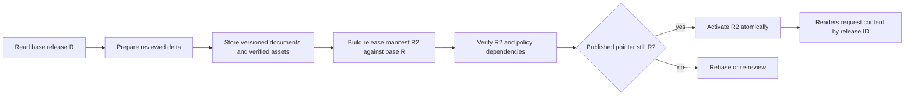

# 6. Publishing architecture case studies

Read alongside [the implemented architecture](04-publishing.md). Sources were
checked on 2026-09-23. Comparisons and recommendations below are design judgments;
proposed mechanisms are explicitly not descriptions of shipped behavior.

Our present model is a small reconciliation system: a local desired scope is
applied to authoritative mutable rows, then checked against a derived reader
view. It already borrows fingerprints and reuse from build systems and ownership
checks from transactional services. The next decision is about the publication
contract, not simply choosing a fashionable storage architecture.

| Case study | Useful idea | Boundary in our system |
| --- | --- | --- |
| Git | Immutable content graph and conditional update of a named release pointer | We have hashes, but mutable current rows and no retained release graph |
| CRDTs | Convergent concurrent editing | Our publisher coordinates one writer per site and does not merge edits |
| Bazel | Explicit inputs and reusable derived outputs | We share parsing and snapshots, but do not maintain a persistent dependency/action cache |
| SQLite/WAL and database transactions | Precisely defined commit and read-snapshot boundaries | Each Convex mutation commits separately; the whole publish is not one transaction |
| Kubernetes controllers | Reconcile desired and observed state; expose readiness separately | We have rebuild scheduling and a readiness poll, not a durable general reconciliation controller |

## Git: make the published thing an identifiable release

Git stores blobs, trees and commits as content-addressed objects. A commit refers
to a tree and ancestry, separating retained content/history from mutable names.
Our hashes and manifests resemble pieces of that model, but the correspondence
stops before an immutable release: document rows are overwritten, snapshots are
replaced, and the prior snapshot blob is deleted. [Git object model](https://git-scm.com/book/en/Git-Internals-Git-Objects).

Git's `update-ref` can require an expected old object ID before updating a ref.
The useful lesson is a **conditional publication pointer**: prepare and verify a
release, then activate it only if the reviewed base is still current. Our builder
already conditionally installs derived output by revision; that pointer does not
version the document bodies readers fetch. [Git reference updates](https://git-scm.com/docs/git-update-ref).

**Where this helps:** coherent multi-document releases, previews, rollback and a
stable object to audit. **Cost:** retained content versions, garbage collection,
release-aware queries and migration of every reader path. A local Git commit
alone cannot provide these properties for independently mutable backend rows.
Current 64-bit document/asset fingerprints also should not silently become the
permanent identity scheme for a new immutable object store; design a versioned
full-digest scheme and explicit migration first.

## CRDTs: converge edits, then separately decide what to publish

CRDTs allow replicas to accept concurrent modifications and merge them under
rules that produce convergence. This addresses offline/multi-user authoring; it
is a different problem from selecting a reviewed release. Our local files, sync
review copies and site publish lease do not constitute a CRDT protocol.
[CRDT research overview](https://crdt.tech/).

**What to borrow:** stable identities and explicit merge semantics if concurrent
editing becomes a product requirement. A CRDT draft could feed the existing
review-and-publish boundary.

**What not to infer:** convergent text is not necessarily a correct narrative,
valid citation set or approved permission change. Access revocation, deletion
and sensitive-asset ownership require deliberate product semantics. Automatically
merging fields does not remove that responsibility, nor does it eliminate blob
uploads, read-model rebuilding or readiness verification.

**Decision:** do not replace publishing with CRDTs for latency. Revisit them when
there is evidence that offline or simultaneous editing is the user problem.
Liveblocks collaboration and browser caching elsewhere in the app do not change
the publish protocol's current concurrency model.

## Bazel: reuse an output only when all its inputs match

Bazel models actions with declared inputs, commands and environment, separates
an action-result cache from a content-addressed output store, and reuses outputs
when the appropriate identity matches. This is a useful model for publishing's
parsing, redaction, asset metadata, embeddings and manifest generation.
[Bazel remote caching](https://bazel.build/remote/caching).

Our direct lesson is to treat **visibility as a dependency**, not a property of
asset bytes. If public page A and private page B reference the same PDF, changing
B's sensitivity must invalidate the PDF's visibility result even when publishing
only A and the bytes have not changed.

A future cached embedding needs the prepared input plus model, dimensions and
preprocessing/chunking versions. A cached redacted page needs source identity and
redaction-policy version. Missing one input makes a fast cache incorrect.

**Decision:** retain measured low-complexity reuse first. Shared parsing cut the
mixed local scan median from 1.194 to 0.716 seconds without persistent state.
A durable dependency graph is justified only if further profiles show enough
repeated work to pay for its maintenance and private-data retention.

## SQLite/WAL and transactions: distinguish a commit from a checkpoint

SQLite readers see committed transactions; in WAL mode, a reader can continue
against its read snapshot while newer commits occur. Checkpointing and committing
are separate operations. These concepts help name our boundaries accurately,
without implying the systems have identical implementations.
[SQLite isolation](https://www.sqlite.org/isolation.html).

Our row mutations are commits; the public manifest is a derived projection, not
a database WAL checkpoint. Convex's per-mutation atomicity does not make a
100-request publish atomic. Abort releases a lease and exposes partial progress;
it does not undo prior document writes. The snapshot builder's paginated reads
also are not one release-wide read transaction.

**What to borrow:** define which version readers are promised. If the promise is
“current selected rows are verified,” keep the present contract explicit. If it
is “all pages and assets belong to one approved release,” introduce versioned
content and pin reader requests to a release. Merely extending the lock timeout
or renaming `/finish` to `/commit` cannot provide that guarantee.

## Kubernetes controllers: separate requested work from observed readiness

Kubernetes controllers repeatedly compare desired and current state, perform
work through APIs and report observed state. Different controllers can own
separate responsibilities. [Kubernetes controller model](https://kubernetes.io/docs/concepts/architecture/controller/).

Our manifest scheduler and `/status` polling already have a small version of
this separation: durable rows can be updated before the reader projection is
ready. The CLI correctly refuses to call that verified success. But there is no
persistent publish resource recording each operation and its recovery progress;
failed builds are retried by later requests/writes or lease recovery.

**What to borrow:** an authenticated publish receipt with explicit states such as
`applying`, `applied`, `reader-ready`, `failed`, and `applied-unconfirmed`, plus
expected/observed revisions. This could support resuming verification after a
lost response without blindly repeating writes.

**Cost:** a recovery state machine, retention policy and more operational state.
Keep synchronous completion truthful; a durable receipt is not permission to
report success as soon as work is queued. This idea does not require deploying
Kubernetes or introducing a background service for every phase.

## A possible atomic-release design — not implemented

The following is a larger product/consistency option, not the next default
performance optimization:

The publication transaction would update one site pointer from R to R2 after
all required objects exist. Unchanged entries inherit from R; a scoped release
must preserve unselected entries, and deletion stays explicit. Pre-activation
failures leave the active pointer unchanged and unreferenced objects eligible
for later cleanup. Lost activation responses can be resolved through the receipt.

The difficult part is everything behind the pointer. Page bodies, attachment
references, navigation and any promised search view must resolve consistently by
release ID. Flipping only today's manifest pointer while page APIs still read
mutable rows would not work. Readers of older releases need an explicit retention
policy. Current authorization and revocation must still govern access; a rollback
must not silently resurrect revoked visibility. If search remains asynchronous,
that limitation must be part of the release contract.

This is a content release graph with conditional activation. It need not reproduce
all Git operations, nor does it require CRDT text merging or event-sourcing every
application mutation.

## Recommended sequence

1. **Keep the present fast path and make its contract explicit.** Preserve fresh
   verification, scoped ownership, automatic scan reuse and no-op snapshot reuse.
   Add interleaving tests for builder activity during an owned run; do not infer
   release isolation from a revision counter that advances only at completion.
2. **Optimize changed-publish projection reads if profiles justify it.** A small
   transactionally maintained document-metadata table could avoid reading large
   bodies to rebuild navigation. Measure end-to-end latency, write amplification,
   backfill cost and drift repair. This is more targeted than a broad disk cache.
3. **Add a publish receipt and remote-base preconditions when review/recovery needs
   demand them.** Distinguish local input fingerprint, reviewed remote base,
   applied revision and verified revision. Whole-site preconditions are simpler
   but reject unrelated changes; per-document preconditions allow more concurrency
   and require a defined overlap/dependency policy. A receipt can accompany the
   current mutable-row design before an immutable release system exists.
4. **Adopt immutable releases only for a concrete consistency/history requirement.**
   Prototype a multi-document change, a visibility change, failure before
   activation, response loss, and rollback before migrating normal readers.
5. **Keep collaborative authoring separate.** Evaluate CRDTs against actual editing
   conflicts/offline requirements, not against the publish benchmark.

These priorities are recommendations, not measured speedups. The measured evidence
is in [the cache experiments](../../specs/publish-cache-experiments-2026-09-23.md).
For any candidate, distinguish local scan time, write time, reader-ready time,
no-op/changed/asset-heavy scopes and fault behavior. A faster acknowledgment is not
a faster completed publish.
