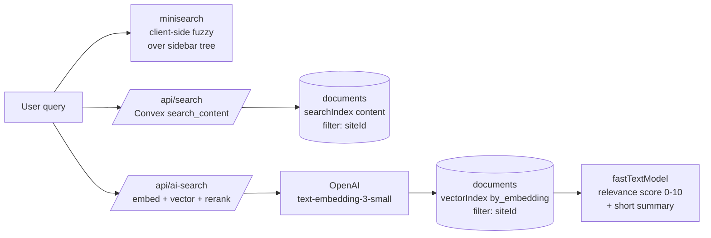
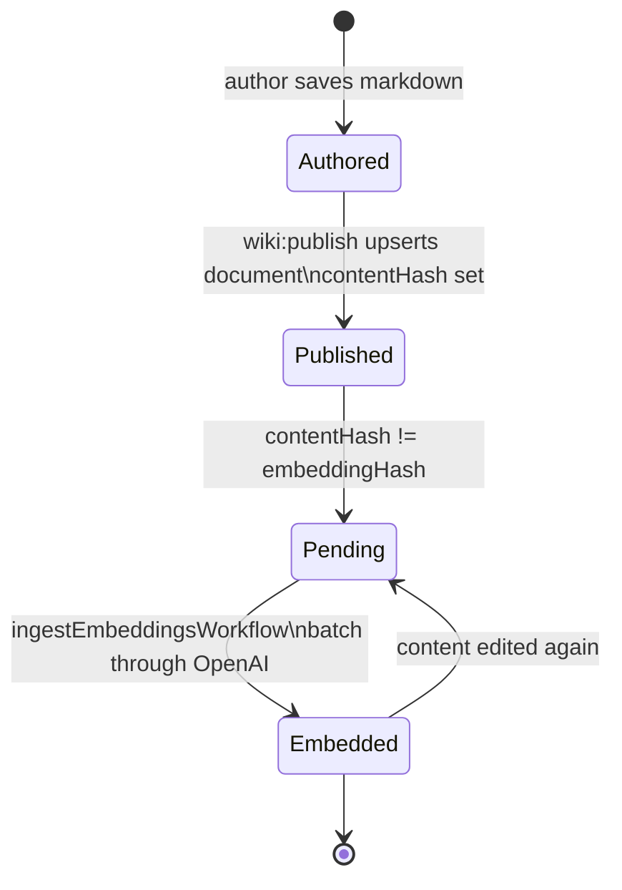

# 5. Chat & Search

Two AI features sit on top of the same retrieval substrate (Convex full-text + vector indexes filtered by `siteId`).

## Search: three flavors



- **Sidebar / command palette** uses `minisearch` against the cached file tree — pure client-side, no network round-trip.
- **`/api/search`** runs Convex's BM25-ish `searchIndex` for keyword-style hits.
- **`/api/ai-search`** embeds the query, top-Ks the vector index, then asks `fastTextModel` (via AI SDK `generateObject`) to score each hit and write a 1-2 sentence "why this matches" summary.

All three are scoped by `siteId` via the `siteSlug` resolved in [proxy.ts](../../src/proxy.ts).

## Chat: streaming with retrieval

[`/api/chat`](../../src/app/api/chat/route.ts) is a thin re-export of [`diana-chat-route.ts`](../../src/lib/diana-chat-route.ts), which builds on the shared `@diana-tnbc/chat` package.

```mermaid
sequenceDiagram
  autonumber
  participant U as Browser (useChat)
  participant API as /api/chat
  participant CV as Convex
  participant OE as OpenAI embeddings
  participant LLM as Chat model
  participant LB as Liveblocks

  U->>API: POST messages, conversationId
  API->>API: ChatRequestSchema.parse (zod)
  API->>CV: load conversation + recent messages\n(siteSlug-scoped)
  API->>OE: embed last user message
  OE-->>API: query vector
  API->>CV: vectorSearch by_embedding\nfilter siteId
  CV-->>API: top-K documents
  API->>API: build system prompt + tools\n(getCachedSystemPrompt)
  API->>LLM: streamText with tools, smoothStream
  LLM-->>API: stream of UIMessage parts
  API-->>U: SSE stream (consumeStream)
  API->>CV: createConvexFlusher\npersist parts every N ms
  Note over U,API: cancel sets canceledAt;\nactiveRunId guards stale writes
```

### Key design decisions

- **Convex as the chat store.** `conversations.streamingText` / `streamingParts` are written incrementally so a user reloading mid-stream still sees the in-progress answer.
- **`activeRunId` guards.** Each run has a fresh `runId`; flushers check it before persisting, so a canceled run can't overwrite a newer one.
- **Validation before AI SDK.** `ChatRequestSchema` rejects malformed bodies with a 400 instead of a 500 deep inside `convertToModelMessages`.
- **Tools, not RAG-only.** The model can call tools (search, fetch by slug) instead of relying only on the initial retrieval — that lets it pivot when the first lookup misses.

## Embedding lifecycle



`embeddingHash` mirrors `contentHash` once the embedding is fresh. The workflow scans for rows where they differ — that's the entire "what needs work" query.

## PII redaction

PII patterns are configured per-site (`sites.config.piiPatterns`). They run:

1. **At publish time** in `applyPiiRedactions` before `documents.content` is written — the cleaned text is what gets indexed/embedded.
2. **At chat time** before retrieved chunks are passed to the model — defense in depth in case patterns were added after a doc was published.

A `?showPII=1` query param (gated by login) flips a request flag that bypasses the chat-time pass for authorized users.

---

That's the tour. Cross-references:

- Specs: [`apps/web/specs/`](../../specs/) — `multi-site.md`, `chat-performance.md`, `pii-redaction.md`, `comments.md`.
- Operator runbook: [`apps/web/specs/operator-runbook.md`](../../specs/operator-runbook.md).
