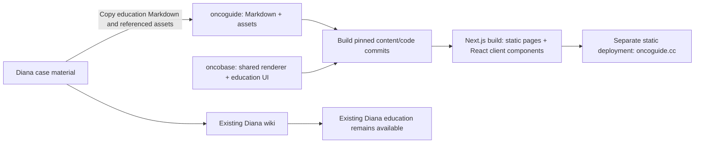

# Oncoguide migration plan

Approved October 9, 2026. The implementation is additive: copy existing Markdown
verbatim and preserve all existing Diana education paths, pages and assets.
The public content repository is https://github.com/jasonLaster/oncoguide.

## Recommendation

Create a public, content-focused `oncoguide` repository and a dedicated
Next.js App Router application at `apps/oncoguide` inside the existing Oncobase
monorepo. Deploy the
application as its own Vercel project at `oncoguide.cc`. Use Oncobase workspace
packages directly for the first release; publish packages to npm later if another
repository actually needs to consume them.

Use Next.js static export (`output: "export"`) to build the public site from Git
into prerendered HTML, page data, a navigation
manifest, a text-search index, and local assets. Git becomes the content publishing
authority. Oncoguide does not need the Diana Convex database, publish tokens,
account services, or asset-ownership checks at request time. The existing Diana
reader and publisher continue to serve Diana's case material.

This requires a small content compiler and renderer adapters. It is more initial
work than adding another hostname to the current app, but creates the independent
education site requested here.



## Next.js rendering architecture

Next.js owns page generation and navigation; the content compiler prepares the
Markdown corpus, metadata, asset map and search index for it. Use a reviewed,
pinned Next.js version, App Router and static export. Server Components run at
build time, producing lesson HTML and navigation payloads. React Client Components
provide the interactive parts after hydration.

| Rendered during the build | Interactive React components |
| --- | --- |
| Lesson text, headings, citations, math and supported diagrams | Search UI and browser-side search over the generated index |
| Page layout, breadcrumbs, topic cards, navigation links and ordinary icons | Mobile menu, expandable sidebar and active navigation state |
| Metadata, sitemap, canonical links and asset URLs | Theme control, image theater, slides and interactive tables/labs |

Keep the Client Component boundary around the controls and enhancements rather
than the entire article or root layout. Plain icons can be server-rendered SVG;
they do not require hydration merely because they are React components. Lazy-load
heavy interactive features when used, retaining readable initial HTML. The shared
Markdown server renderer and `WikiMarkdownFrame` are starting points; adapt their
route/asset handling and attach the existing media/table enhancements through
small client boundaries. Do not mount the current fetch-driven `EducationApp` as
one large Client Component.

Proposed app shape:

```text
apps/oncoguide/
  app/layout.tsx           # shared education styling and page chrome
  app/page.tsx             # public library home
  app/education/[...slug]/page.tsx # build-generated concepts, guides and lessons
  app/wiki/education/[...slug]/page.tsx # compatibility aliases
  app/education/search/page.tsx # static frame plus a client search component
  app/sitemap.ts
  app/robots.ts
  components/             # small React controls and enhancements
  lib/content.server.ts   # reads the pinned, prepared content at build time
  public/                 # generated static assets and search index
  next.config.ts
```

Enumerate every lesson route with `generateStaticParams`, use
`dynamicParams = false`, and generate metadata from the same content inventory.
Search query parameters are read by the client component inside an appropriate
Suspense boundary; they do not require per-request page generation. Content stays
Markdown by default. Interactive teaching components can use a small documented
directive/schema without requiring authors to maintain application code or
convert the full corpus to MDX.

Use local images with explicit dimensions and, where useful, variants generated
at build time. Static export cannot use the default request-time `next/image`
optimizer; use a static asset adapter or a compatible loader. Build-generated
static pages implement legacy aliases; their metadata names the canonical
`/education/...` route. No cookies, Server Actions, ISR or request-time
content API are required for this design. New content is published by rebuilding
the pinned corpus. Next.js can support server features later if requirements
change; that would be an explicit deployment change.

The proof must run `next build` and serve the exported `out/` directory, not just
`next dev`. Verify lesson text without JavaScript, React interactions with
JavaScript, direct entry to nested routes, theme hydration, client navigation and
bundle size.

## Evidence from the current implementation

- The current `EducationApp` already provides the header, topic cards, sidebar,
  article frame, search, theme control, and responsive navigation without mounting
  the care reader. Its data fetching and route prefix are coupled to
  `/api/education` and `wiki/education/`.
- `wiki-markdown` supports host-owned routing and rendering adapters. Static
  asset resolution needs an adapter: the existing paths helper routes many image
  formats through `/api/file`.
- Theme colors inherit app-level variables. Extract the complete light/dark
  education theme, fonts, media styles, and green interaction states together;
  copying only `education.css` would miss those dependencies.
- The dedicated education API currently rejects non-Diana site slugs, and the
  browser host classifier treats hosts other than Oncobase marketing as Diana.
  Adding a domain alone would not create an independent education site.
- Shared packages currently export TypeScript source and use workspace
  dependencies. Registry queries for `@oncobase/wiki-content` and
  `@oncobase/wiki-markdown` returned 404; a usable public npm release would require
  its own packaging and dependency work.
- The fetched Diana `origin/main` snapshot is
  `01a6c4ee948734925e77e5122b4968b59f76a777`: 116 Markdown pages in education,
  34 mentioning Diana, and 71 containing detected links outside education.
  Those link counts are an inventory heuristic, not completed editorial review.
  The tree also contains 238 PNGs, prompt/text files, an HTML lab, and a zip;
  copy the reviewed dependency set rather than the entire folder blindly.

## Repository responsibilities

| Location | Owns |
| --- | --- |
| `oncoguide/wiki/education/` | Copied Markdown, illustrations, citations and referenced downloads, keeping existing paths |
| `oncoguide/provenance.json` | Source commit and SHA256 import receipt |
| `oncoguide/renderer.lock.json` | Exact Oncobase renderer revision used for releases |
| `oncoguide/README.md` | Authoring, contribution and release instructions |
| `oncoguide` workflow | Content checks, previews, and release initiation; no application implementation |
| `oncobase/apps/oncoguide/` | Next.js App Router pages/layouts, static build integration, React enhancements, search adapter, SEO and deployment configuration |
| Oncobase shared packages | Markdown behavior, media interactions, education UI and theme |
| Diana wiki | Case status, results, treatment reasoning, vendor engagement and source custody |

Every file committed to the public repository is publishable source. Missing
`sensitive` metadata means public; private markers cause validation failure rather
than silently hiding files that GitHub would still expose. Start with a fresh
history containing only the reviewed export, with provenance mapping to the
source commit. Do not import the private Diana repository's complete Git history.

## Migration sequence

1. **Freeze and inventory the source.** Work from a clean, explicitly selected
   committed Diana snapshot, preserving unrelated local work. Record every page,
   source hash, proposed path, aliases and dependencies. Carry forward the October 8
   curriculum standards, taxonomy and dispositions rather than redesigning them.
   Retain concepts, guides, legacy lesson paths and ordering at launch.

2. **Prove the reusable reader with three pages.** Use a concept, a vaccine lesson,
   and the autophagy pathway lesson. Extract configurable education presentation
   into a small shared module/package, with separate loaders for the current API
   reader and the Next.js static Oncoguide reader. Reuse Markdown, theme, image theater,
   tables, math and Mermaid behavior. Keep existing renderer defaults compatible
   with Diana; provide explicit route and asset resolvers for the new site.
   Generate actual lesson HTML for direct links and search engines, not just an
   empty SPA shell. Verify the three pages before moving the full corpus.

3. **Copy the public corpus.** Export all 116 committed education Markdown pages
   verbatim, with their 61 referenced assets, including inferred dark companions
   and downloads. Record SHA256 hashes and the source commit in `provenance.json`.
   Hydrate and verify LFS media before copying. Existing case examples remain as
   written; references outside education point back to Diana. Do not copy private
   source captures, rewrite lessons, delete originals, or alter Diana's publisher.

   Adapt wiki paths, file-API links and direct Diana Blob URLs to local dependencies
   during rendering, leaving the Markdown source unchanged. Preserve alt text,
   credits, topic order, existing path segments and source attribution.

4. **Implement the public build.** Shared Oncobase packages supply Markdown,
   education presentation, theme controls, image theater, tables and slides.
   Next.js Server Components generate static lesson HTML with `generateStaticParams`.
   Small Client Components provide search, themes, menus and enhancements.
   Serve the library at `/` and `/education`, with lessons at `/education/...`.
   Emit static `/wiki/education/...` and indexless aliases too. Produce canonical
   metadata, sitemap, robots, a search index and build provenance. No runtime image
   or content request may require the Diana backend.

5. **Pin code and content for independent releases.** Link the dedicated Vercel
   project to the public content repository. Its build script checks out the exact
   Oncobase SHA in `renderer.lock.json`, installs the locked dependencies and builds
   only the Next.js app. Content changes receive native Git previews/production
   builds and GitHub static/browser checks. Application changes run against the
   default content SHA in `apps/oncoguide/content.lock.json`; release them by bumping
   the content repository's renderer lock. Record both commits in `build-info.json`.
   This avoids cross-repository deployment secrets and moving renderer branches.

   Build validation checks all routes and assets, rejects private markers,
   unresolved education links, LFS pointers and Diana image dependencies, and
   limits all client JavaScript (including lazy chunks) to 350 KiB gzip. Browser CI
   decodes every image, verifies static HTML without JavaScript, and exercises
   search, persisted themes, mobile navigation and image theater.

6. **Publish the additional site.** Attach the already-owned `oncoguide.cc` domain
   to its own Vercel project. Stage a production build, verify it, then promote the
   tested deployment and verify the public domain. Keep Diana's domain, education
   routes, Markdown, assets, backend and publishing process unchanged. Verify its
   renderer defaults and theme behavior as part of the shared-package change.

7. **Maintain both copies deliberately.** OncoGuide edits can now happen publicly
   in its content repo. Diana remains an independent existing copy; automatic
   bidirectional synchronization is outside this release. Any future redirect,
   deletion or single-owner cutover requires a separate decision.

## Acceptance checks

- Every copied source page has a canonical route and working compatibility aliases;
  anchors, wikilinks and citations are preserved.
- Required local assets exist and contain actual media bytes. Both light/dark
  companions are included. Decode every rendered image, including hidden and lazy
  images; report page and asset URL for failures.
- Validate public front matter and local education links during compilation.
  Verify corpus navigation and retain existing ordered guides.
- Test hub, search, article navigation, keyboard use, mobile layout and persistent
  light/dark themes, including hover/focus colors and complex Markdown features.
- Fetch representative lesson HTML without JavaScript and verify the lesson text,
  canonical URL, metadata and sitemap coverage.
- Run the static export through a static server in CI; verify every expected
  lesson was emitted and all nested direct links work. Check hydration and
  JavaScript budgets, including lazy loading of heavier interactive features.
- Fail if the generated site contains unresolved Diana API/Blob dependencies or
  imports the care reader's clinical/account runtime. Measure the app bundle.
- Run browser/media checks after content changes and renderer changes, including
  an injected missing dark image to prove the scan detects that failure class.
- Confirm the existing renderer retains default wiki URLs and Diana theme behavior.
  Verify public Diana education images without changing its content or assets.

## Alternatives and decision points

| Approach | Tradeoff |
| --- | --- |
| Content repo + dedicated Next.js app in Oncobase + static export | Recommended: shared appearance/behavior, separate releases, public source and assets; needs build adapters and a two-repository release workflow |
| Content repo + another site in the existing full app/backend | Smaller initial publishing change, but requires making Diana-specific education assumptions configurable and retains shared backend/deployment coupling |
| Content and app in `oncoguide`, consuming npm packages | Good future independent ownership; first requires real package builds, exports, dependency versioning and releases |
| Copy the entire app into `oncoguide` | Fast to start, but carries legacy features and creates a second implementation to maintain |

The user selected a backward-compatible copy, so no editorial separation or
source deletion is part of launch. The initial public copy preserves source
credits and grants no new reuse license. Domain ownership was verified in the
existing Vercel account; no registration purchase is needed.

Vercel supports separate projects for monorepo applications:
[monorepo documentation](https://vercel.com/docs/monorepos). External content
changes can trigger builds through
[deploy hooks](https://vercel.com/docs/deploy-hooks), although the exact-commit
workflow above offers stronger release traceability. A
[staged production deployment can be promoted without rebuilding](https://vercel.com/docs/deployments/promoting-a-deployment),
which lets the release use the build that passed the browser checks.

Next.js explicitly supports build-time Server Components and hydrated Client
Components in [static exports](https://nextjs.org/docs/app/guides/static-exports).
Keep interactive boundaries small according to the
[Server and Client Components guidance](https://nextjs.org/docs/app/getting-started/server-and-client-components).

## First release — October 9, 2026

- Public site: https://oncoguide.cc. Content repository:
  https://github.com/jasonLaster/oncoguide (public, `main`).
- Content commit: `2e110433957e483d0533476ab63c68e6014c1441`.
  Pinned application commit: `a0a74ba66afd466d4fd2fe8b30e4c9ede13ef9f0`.
  Both are exposed in `/build-info.json` and matched the verified deployment.
- All 116 Markdown files match their committed Diana source byte-for-byte.
  All 177 copied Markdown/media files match the SHA256 import receipt.
- Static export emitted every lesson and compatibility alias, with 61 local
  assets and 212 KiB gzip JavaScript including lazy chunks on the hosted build.
- Unit checks: 31 passed. OncoGuide GitHub checks passed in both repositories.
  Hosted and public-domain browser checks passed: 116 lessons, 66 image elements,
  zero failures; search, themes, mobile navigation, client navigation, image
  theater, metadata and no-JavaScript reading also passed.
- Diana's live image audit passed independently: 116 pages, 66 images, zero
  failures. Its existing vaccine and autophagy URLs returned 200 without redirects.
  Existing theme/landing checks, app typecheck and build passed locally.
- No Diana content or assets were edited, removed or republished by this copy.
  Future edits remain independent between repositories.
