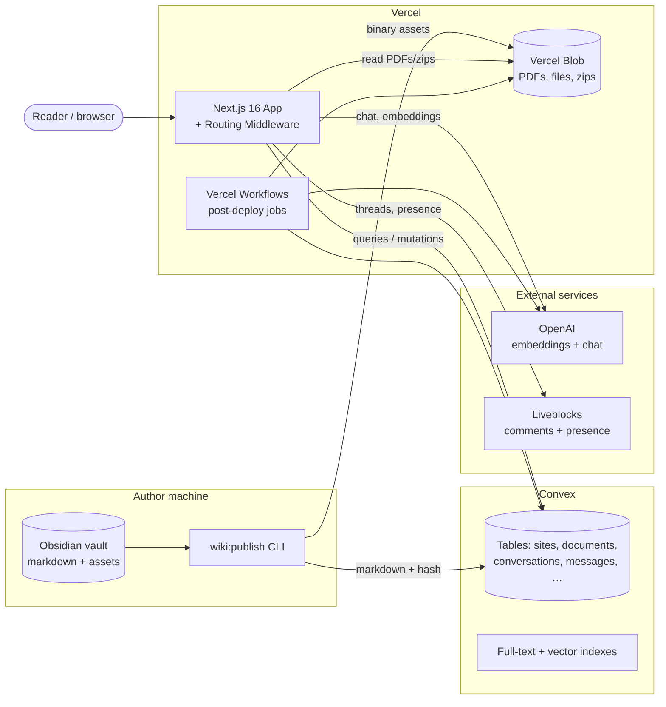

# 1. System Overview

The product is a **multi-tenant wiki + AI assistant**. Authors keep content in an Obsidian vault, a publish script ships it to the cloud, and readers browse a Next.js site that can answer questions about the content.

## Major components

## What each piece is for

| Component | Responsibility |
|---|---|
| **Next.js app** (`web/src/app`) | Pages, API routes, the chat runtime, the file/PDF proxy. Deployed to Vercel. |
| **Routing middleware** (`web/src/proxy.ts`) | Resolves the active site from the `Host` header, gates passwords, and forwards `x-site-slug` to every downstream handler. |
| **Convex** (`web/convex`) | Source of truth for documents, conversations, users, comments. Provides full-text + vector search. |
| **Vercel Blob** | Binary storage for PDFs, attachments, and prebuilt download zips. |
| **Vercel Workflows** (`web/src/workflows`) | Durable post-deploy jobs: build download caches, generate AI page descriptions, embed new pages. |
| **OpenAI** | `text-embedding-3-small` for retrieval, GPT-class models for chat answers. |
| **Liveblocks** | Realtime threads on each page (comments) and guest-name persistence. |
| **Obsidian vault** | Author-side source. Lives in `obsidian/` at the repo root; `wiki:publish` is the only thing that promotes it. |

## Runtime characteristics

- **Edge → Fluid Compute.** Middleware and route handlers run on Vercel's Node runtime (Fluid Compute). No Edge-runtime constraints.
- **Stateless app, stateful Convex.** The Next.js layer holds no per-tenant state; everything site-scoped is fetched by `siteSlug` on each request.
- **Cache by site.** `getFileTree()` and other server-cached values are keyed by `siteSlug` so one tenant's tree never shadows another's.

Continue to [Request flow & multi-tenancy →](02-request-flow.md)
