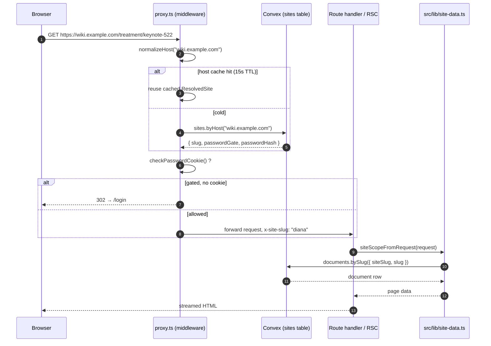
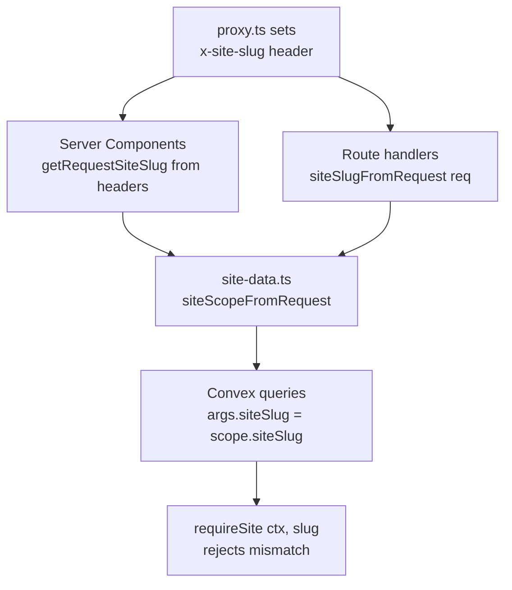

# 2. Request Flow & Multi-Tenancy

One codebase, many sites. The trick: every request is tagged with a **`siteSlug`** at the very edge, and that slug threads through every downstream call.

## End-to-end path

## How `siteSlug` is resolved

`web/src/proxy.ts` runs on every matched route. It picks a slug from, in order:

1. `SITE_SLUG` env override (CI, scripts).
2. `.local-hosts.json` mapping (dev: `acme.localhost` → `acme`).
3. `*.localhost` subdomain stripping.
4. Vercel preview hostname pattern (`diana-tnbc-*` → preview slug).
5. **Convex lookup** by exact `Host` header against `sites.domains[]`.
6. Default: `"diana"` (legacy).

The result is cached in-process for 15 seconds (`HOST_CACHE_TTL_MS`) to avoid hitting Convex on every asset request.

## How the slug propagates

Three rules keep the boundary tight:

- **Never read `x-site-slug` ad-hoc.** Always go through `getRequestSiteSlug()` (RSC) or `siteSlugFromRequest()` (handlers). Both return a branded `SiteSlug` so a raw string can't sneak through.
- **Every Convex query takes `siteSlug`.** `site-data.ts` provides typed wrappers (`querySite`, `mutateSite`) that inject it; you can't accidentally call a tenant query without one.
- **Convex enforces it.** Inside Convex, `requireSite(ctx, slug)` resolves `siteId`, throws on mismatch, and is the only sanctioned way to land on the table. Indexes are `by_site_*` so cross-tenant scans are impossible by construction.

## Routes that bypass the proxy

A few routes are intentionally outside the proxy matcher:

| Route | Why |
|---|---|
| `/api/file` | Public Blob proxy; the URL itself encodes the site. |
| `/api/share-preview` | OG image generation; uses query params, not `Host`. |
| `/api/post-deploy` | Vercel workflow webhook; called server-to-server. |
| `/api/liveblocks-webhook` | Liveblocks → us; signed by Liveblocks, not host-bound. |

These accept a default-site fallback inside `site.ts`. **Don't add new routes to this list without a reason** — the default is the proxy.

Continue to [Data model →](03-data-model.md)
