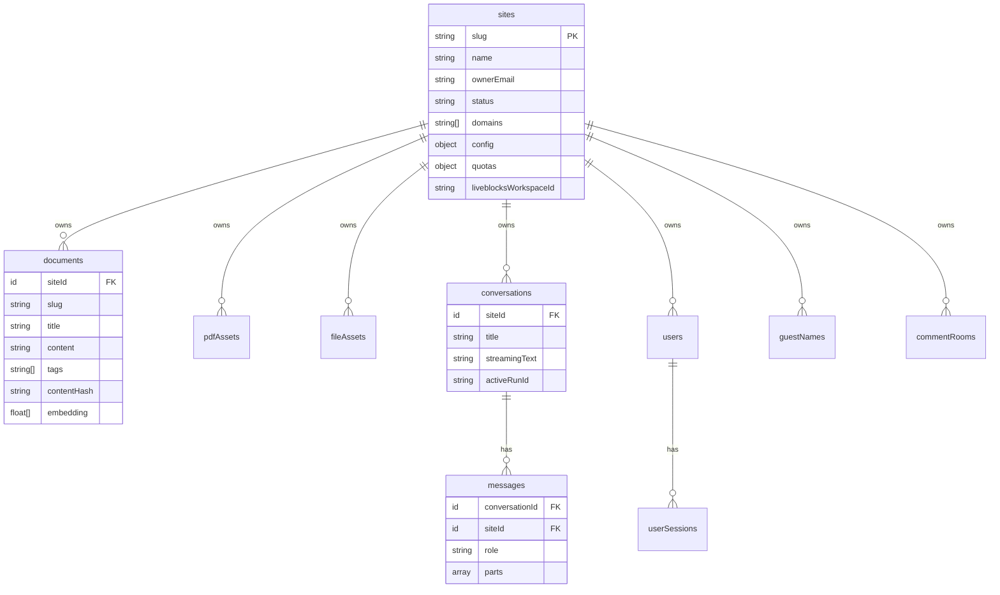
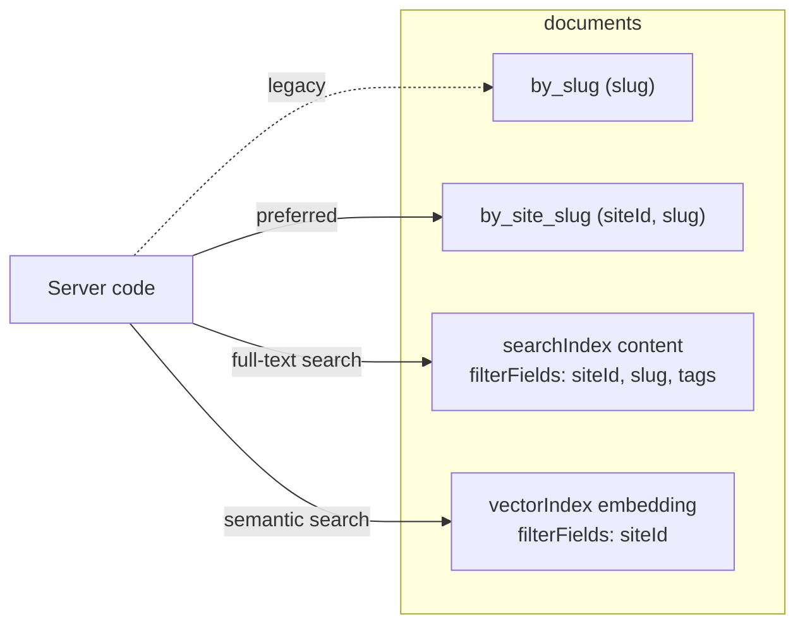
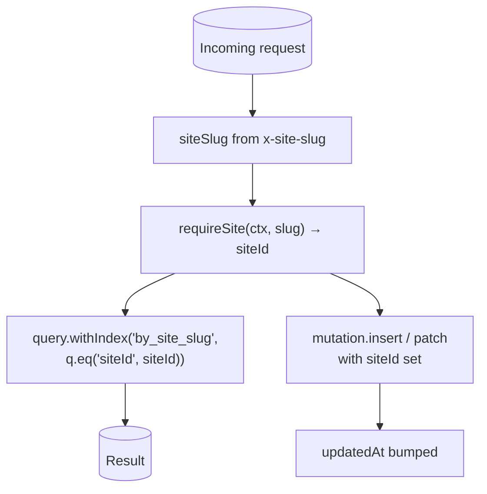

# 3. Data Model

Convex is the source of truth. Schema lives in [`web/convex/schema.ts`](../../convex/schema.ts). Every tenant-owned row carries an optional `siteId` (optional only because of the Diana-era backfill window — new writes always set it).

## Table relationships

## The two important indexes

Each tenant table has a **slug-only** index (legacy) and a **site-scoped** composite index. New code must use the site-scoped one.

Why both indexes still exist: during the Diana → multi-tenant cutover some legacy rows had no `siteId`. Reads against `by_slug` would silently return rows from the wrong tenant. The fix was a separate `by_site_slug` index plus a backfill (`scripts/admin/backfill-site-ids.ts`). Search and vector indexes added `siteId` to `filterFields` so ranking can't leak across tenants.

## The `siteId` invariant

- **Reads** must include `siteId` in the index range.
- **Writes** must include `siteId` in the row.
- **Search/vector** must include `siteId` in the filter.

Cross-site leak tests in CI run a fixture with two sites and assert that reads/searches/embeddings against site A never surface site B rows ([`web/specs/multi-site.md`](../../specs/multi-site.md)).

## Storage: where does each kind of asset live?

| Kind | Where | Why |
|---|---|---|
| Markdown body, frontmatter, tags | `documents.content` (Convex) | Fast full-text + vector search. |
| Embedding vector | `documents.embedding` (Convex) | Co-located with content for filterFields. |
| PDF binary | Vercel Blob; URL stored in `pdfAssets.blobUrl` | Convex isn't for blobs; Blob is cheap and CDN-fronted. |
| Other attachments | Vercel Blob via `fileAssets` | Same reason. |
| Prebuilt download zips | Vercel Blob, public | Built by `buildDownloadCacheWorkflow` post-deploy. |
| Liveblocks threads | Liveblocks (external) | Realtime concerns, not ours. We only store `commentRooms` counts for UX. |

Continue to [Publishing pipeline →](04-publishing.md)
