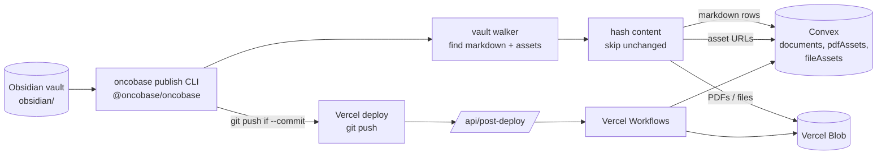
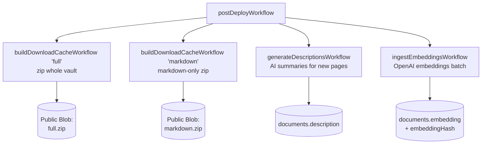

# 4. Publishing Pipeline

Authors edit markdown in Obsidian. To make those edits live, they run `oncobase publish` directly or through the repo's `wiki:publish` script. Everything between "save in Obsidian" and "live on the site" happens in this pipeline.

## High-level flow

## What `oncobase publish` does

1. **Walks the vault** (`@oncobase/oncobase`) skipping `.obsidian`, `Clippings`, `Google Drive`, etc.
2. **Per markdown file**: parses frontmatter (`gray-matter`), applies PII redactions (`pii-redaction.ts`), computes a SHA hash of the post-redaction body. If the hash matches Convex's stored `contentHash`, skip — otherwise upsert into `documents`.
3. **Per binary asset**: hashes the file. If unchanged, skip. Otherwise uploads to Vercel Blob and upserts a `pdfAssets` / `fileAssets` row pointing at the new `blobUrl`.
4. Optionally commits + pushes, which triggers a Vercel deploy.

The hash-skip step is what makes incremental publishes fast — only the diff hits the network.

## Post-deploy: durable workflows

After a successful production deploy, GitHub Actions hits `POST /api/post-deploy`, which kicks off [`postDeployWorkflow`](../../src/workflows/post-deploy.ts). It fans out four child workflows in parallel:

Each child is **independently retryable**. If OpenAI rate-limits one batch inside `ingestEmbeddingsWorkflow`, only that batch retries — the rest keep going.

### Why workflows, not build steps?

Embeddings and description generation used to run during `next build`. That:

- blocked deploys behind OpenAI latency,
- billed OpenAI on every preview deploy,
- couldn't retry without a full redeploy.

Moving them post-deploy decouples render from AI side-effects. The site renders the moment Vercel is happy; embeddings catch up asynchronously.

## Site-admin scripts

These don't run on every publish, but you'll meet them when onboarding a tenant. They live in `web/scripts/admin/`:

| Script | Use when |
|---|---|
| `wiki:site:create` | Bring up a new tenant — inserts the `sites` row, attaches domains. |
| `wiki:site:token:add` | Add a publish token without invalidating existing publishers. |
| `wiki:site:archive` / `restore` | Soft-archive a tenant; flips `status` and stops public reads. |
| `wiki:site:lock-clear` | Clears `publishLockUntil` if a publish hung. |
| `wiki:site:backfill` | Backfills `siteId` on legacy rows (one-time per tenant). |

Continue to [Chat & search →](05-chat-and-search.md)
